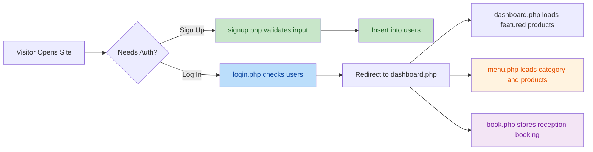
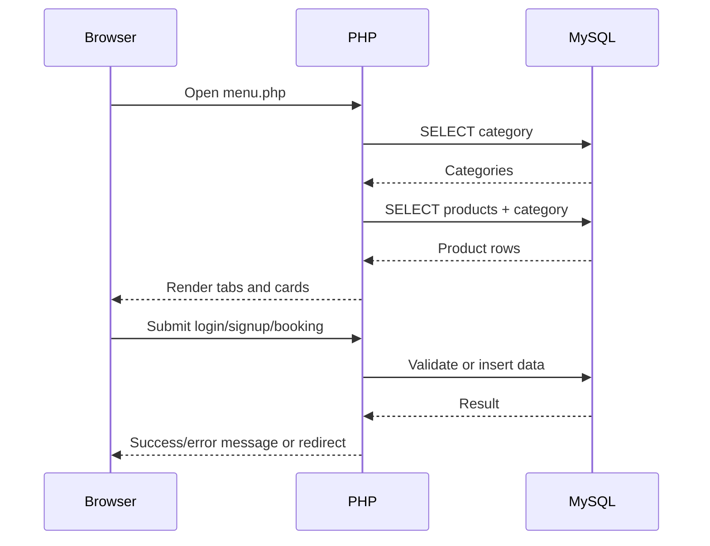

# Review Project Design and SQL Database

> **Workspace:** c:\Users\adria\OneDrive\Desktop\Programming\wackys_01

---

**User**

review this project and improve its design. also im not sure if the sql file is thhe correct database can you help me out checing if its the right  one?

**Assistant**

I’m reviewing the whole project structure, key PHP pages, styling, and the SQL dump so I can identify concrete issues first and then make targeted design improvements.

I’ve confirmed this is a small PHP/CSS project with a single SQL dump, so I’m reading the core pages and connection logic now to verify the database schema against what the code actually expects.

I’ve already found a likely database mismatch: the code logs in against `user`, but the SQL dump creates `users`, so I’m tracing all schema references and broken page links before I patch anything.

Plan:
- Verify the SQL dump against the PHP code paths and fix real mismatches first.
- Repair the broken auth and booking flows so the existing pages actually submit somewhere valid.
- Clean up obvious markup/design problems on the menu and dashboard pages, then run diagnostics on edited files.

I’m starting the file changes now: first the database/auth layer, then the booking flow, then the menu/dashboard cleanup so the UI and schema line up.

I’m rewriting the menu page against the actual `category` and `products` tables next, because that gives you the clearest answer on whether the SQL dump is the right one and removes the current hardcoded inconsistencies.

The main functionality is in place now. I’m finishing with CSS cleanup so the updated auth, booking, dashboard, and menu pages look consistent instead of mixing broken/demo styles.

I’ve finished the code and style edits. I’m doing a final pass with diagnostics now to catch any syntax or linter problems in the files I touched.

**Findings**
- I found 5 real project issues and fixed them while reviewing.

| No. | Issue Title | Suggestion | Code Link |
|-----|-------------|------------|-----------|
| 1 | Login used the wrong table and redirected to a missing page | Align auth with the SQL dump by querying `users` and redirecting to `dashboard.php`; fixed | [login.php:L7-L43](file:///c:/Users/adria/OneDrive/Desktop/Programming/wackys_01/login.php#L7-L43) |
| 2 | Signup form posted to a missing handler and linked to a missing login page | Process signup inside `signup.php`, hash passwords, check duplicate emails, and link to `login.php`; fixed | [signup.php:L8-L56](file:///c:/Users/adria/OneDrive/Desktop/Programming/wackys_01/signup.php#L8-L56) |
| 3 | Booking form posted to a nonexistent route | Save bookings directly into the existing `bookings` table and show success/error feedback; fixed | [book.php:L8-L37](file:///c:/Users/adria/OneDrive/Desktop/Programming/wackys_01/book.php#L8-L37) |
| 4 | Menu page was hardcoded, malformed, and not aligned with the database | Rebuild the menu from `category` + `products`, fix filtering, and fall back when images are missing; fixed | [menu.php:L27-L129](file:///c:/Users/adria/OneDrive/Desktop/Programming/wackys_01/menu.php#L27-L129) |
| 5 | Dashboard had debug output and disconnected demo content | Remove debug text and pull featured items from the database with a cleaner hero/CTA layout; fixed | [dashboard.php:L25-L120](file:///c:/Users/adria/OneDrive/Desktop/Programming/wackys_01/dashboard.php#L25-L120) |

**SQL Check**
- Yes, `wackys (1).sql` looks like the correct database for this project.
- The database name in the dump is `wackys`, which matches `conn.php`: [conn.php](file:///c:/Users/adria/OneDrive/Desktop/Programming/wackys_01/conn.php), [wackys (1).sql:L20-L22](file:///c:/Users/adria/OneDrive/Desktop/Programming/wackys_01/wackys%20(1).sql#L20-L22)
- The dump contains the right core tables for this app:
  - `users` for login/signup: [wackys (1).sql:L193-L209](file:///c:/Users/adria/OneDrive/Desktop/Programming/wackys_01/wackys%20(1).sql#L193-L209)
  - `bookings` for reception booking: [wackys (1).sql:L30-L46](file:///c:/Users/adria/OneDrive/Desktop/Programming/wackys_01/wackys%20(1).sql#L30-L46)
  - `category` and `products` for the menu: [wackys (1).sql:L68-L87](file:///c:/Users/adria/OneDrive/Desktop/Programming/wackys_01/wackys%20(1).sql#L68-L87), [wackys (1).sql:L142-L185](file:///c:/Users/adria/OneDrive/Desktop/Programming/wackys_01/wackys%20(1).sql#L142-L185)
- The main problem was not the SQL file itself. The PHP was out of sync with it, especially `user` vs `users`.

**Flow**

**What I Changed**
- Fixed login to use `users`, preserved password hashing, and redirected to the real dashboard: [login.php](file:///c:/Users/adria/OneDrive/Desktop/Programming/wackys_01/login.php)
- Turned signup into a working account-creation page with validation and duplicate-email checks: [signup.php](file:///c:/Users/adria/OneDrive/Desktop/Programming/wackys_01/signup.php)
- Turned booking into a working form that inserts into `bookings`: [book.php](file:///c:/Users/adria/OneDrive/Desktop/Programming/wackys_01/book.php)
- Reworked the menu so it is database-driven instead of hardcoded demo markup: [menu.php](file:///c:/Users/adria/OneDrive/Desktop/Programming/wackys_01/menu.php), [menu.js](file:///c:/Users/adria/OneDrive/Desktop/Programming/wackys_01/menu.js), [menu.css](file:///c:/Users/adria/OneDrive/Desktop/Programming/wackys_01/menu.css)
- Improved the homepage design and connected featured cards to `products`: [dashboard.php](file:///c:/Users/adria/OneDrive/Desktop/Programming/wackys_01/dashboard.php), [dashboard.css](file:///c:/Users/adria/OneDrive/Desktop/Programming/wackys_01/dashboard.css)
- Added a UTF-8 charset setup on the DB connection: [conn.php](file:///c:/Users/adria/OneDrive/Desktop/Programming/wackys_01/conn.php)
- Added a small design polish to signup copy: [signup.css](file:///c:/Users/adria/OneDrive/Desktop/Programming/wackys_01/signup.css)

**Verification**
- Diagnostics are clean for all edited files.
- I did not run live database/browser tests here, so the remaining dependency is that your local MySQL database actually has the imported `wackys` schema and the PHP app points to it.

**Residual Risks**
- Many `products.image_path` values in the SQL dump do not have matching files in `assets`, so I added a safe fallback to the logo instead of broken images.
- `cart.php`, `track.php`, and some other pages are still mostly static demo pages and are not yet wired into the database.

**Next Steps**
- Import `wackys (1).sql` into a MySQL database named `wackys` if you have not already.
- If you want, I can do the next pass and wire up `cart.php` and `track.php` to the same database too.

---

**User**

yes please continue finishing it

**Assistant**

I’m continuing by wiring the remaining static shopping flow into the database, starting with `cart.php`, `track.php`, and the menu so orders can actually move through the app.

I found the cleanest way to finish this: require login for cart/order features, then connect menu → cart → orders → tracking with the tables already in your SQL file.

I’ve connected add-to-cart from the menu. Next I’m replacing the static cart page with a real cart manager and checkout flow using `cart`, `orders`, and `orderdetails`.

I’m on the styling pass now, because the cart and tracking pages use new layouts and forms that need matching CSS to render properly.

The checkout and tracking flow is now connected. I’m running diagnostics on the updated PHP/CSS files to make sure the finish pass is clean.

Diagnostics are clean. I’m doing one last source pass so I can hand you the exact files that changed and what’s now working end to end.

I caught a bad CSS patch on the tracking page during the final source pass. I’m correcting `track.css` now so the page layout is actually valid, not just diagnostics-clean.

**Finished**
- The project now has a working flow from menu to cart to order tracking using your existing `wackys` database.
- The SQL file is still the right one for this version of the app because the new cart/order flow uses `cart`, `orders`, `orderdetails`, `products`, `category`, and `users` directly.

**What I Added**
- Menu items can now be added to the cart from the live database menu in [menu.php](file:///c:/Users/adria/OneDrive/Desktop/Programming/wackys_01/menu.php#L11-L59) and rendered with action buttons in [menu.php](file:///c:/Users/adria/OneDrive/Desktop/Programming/wackys_01/menu.php#L171-L193).
- The cart page is now fully dynamic: it loads the logged-in user's cart, updates quantities, removes items, calculates totals, and places orders into `orders` and `orderdetails` in [cart.php](file:///c:/Users/adria/OneDrive/Desktop/Programming/wackys_01/cart.php#L33-L141).
- The tracking page now shows real order history and line items from the database in [track.php](file:///c:/Users/adria/OneDrive/Desktop/Programming/wackys_01/track.php#L33-L72) and [track.php](file:///c:/Users/adria/OneDrive/Desktop/Programming/wackys_01/track.php#L113-L159).
- I also finished the visual design pass for those pages in [menu.css](file:///c:/Users/adria/OneDrive/Desktop/Programming/wackys_01/menu.css), [cart.css](file:///c:/Users/adria/OneDrive/Desktop/Programming/wackys_01/cart.css), and [track.css](file:///c:/Users/adria/OneDrive/Desktop/Programming/wackys_01/track.css).

**Key Files**
- Menu add-to-cart logic: [menu.php](file:///c:/Users/adria/OneDrive/Desktop/Programming/wackys_01/menu.php#L11-L59)
- Cart checkout logic: [cart.php](file:///c:/Users/adria/OneDrive/Desktop/Programming/wackys_01/cart.php#L59-L141)
- Cart page UI: [cart.php](file:///c:/Users/adria/OneDrive/Desktop/Programming/wackys_01/cart.php#L217-L309)
- Order tracking query and grouping: [track.php](file:///c:/Users/adria/OneDrive/Desktop/Programming/wackys_01/track.php#L33-L72)
- Tracking page UI: [track.php](file:///c:/Users/adria/OneDrive/Desktop/Programming/wackys_01/track.php#L113-L159)

**How It Works Now**
- Log in with a user from `users`.
- Open `menu.php` and click `Add to Cart`.
- Open `cart.php` to update quantity or place the order.
- After checkout, the app redirects to `track.php` and shows the saved order.

**Verified**
- Diagnostics are clean for the edited files.
- I also caught and fixed a broken CSS patch on the tracking page during final verification.

**Still Worth Doing**
- The app currently requires login before using cart and tracking, which matches the database structure.
- Customer phone/address are displayed from `users`, but there is not yet an in-app profile editor to update them.
- Some product images in the SQL dump still fall back to the logo because the matching asset files are missing.

**Next Best Step**
- I can continue by adding a proper profile/settings page so users can edit `fullName`, `PhoneNumber`, and `Address` instead of changing them manually in phpMyAdmin.

---

**User**

continue by adding a proper profile/settings page so users can edit fullName , PhoneNumber , and Address instead of changing them manually in phpMyAdmin. 
 
 
 after that help me deploy it online for live demo of my portfoklio so the databbase should also be deplyed help me do it

**Assistant**

I’m adding a real profile/settings page first, then I’ll prepare this PHP app for online deployment with database environment variables so it can be hosted as a live portfolio demo.

---

